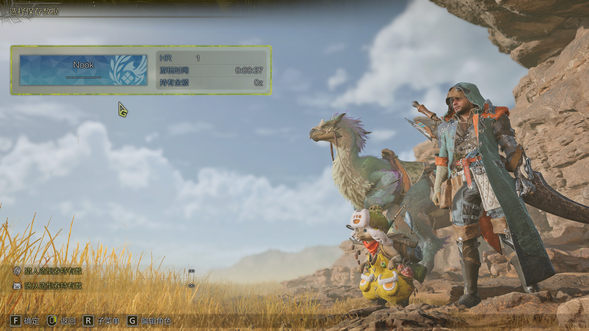

# Monster Hunter Wilds MITM Script
## User Guide
1. Download the [mitmproxy](https://mitmproxy.org/) and install it with cert
    1. Run `mitmproxy.exe --mode transparent`
    2. Access http://mitm.it/
    3. Click `Get mitmproxy-ca-cert.p12` to download it
    4. Check the `Show Instructions` and follow the steps then stop the mitmproxy.exe
2. Download the `run.py` or copy it to the local file `%UserProfile%/Downloads/run.py`
3. Run `mitmproxy.exe -s $env:UserProfile/Downloads/run.py --mode local:MonsterHunterWildsBeta.exe` (in Administrator PowerShell)
4. Just play it

## Update
In this script, the online APIs are mocked to null (credit to @[RedPig-Lin](https://github.com/RedPig-Lin)), so you won’t be kicked out of the starting world. However, after completing the first chapter and logging out, you won’t be able to re-enter.

## Game

